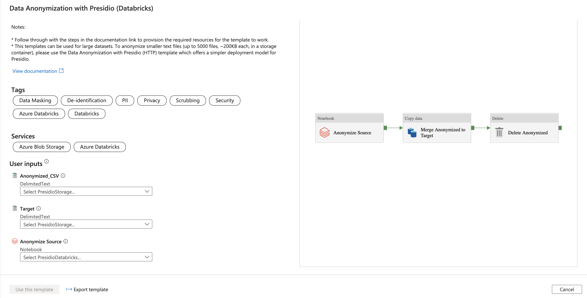
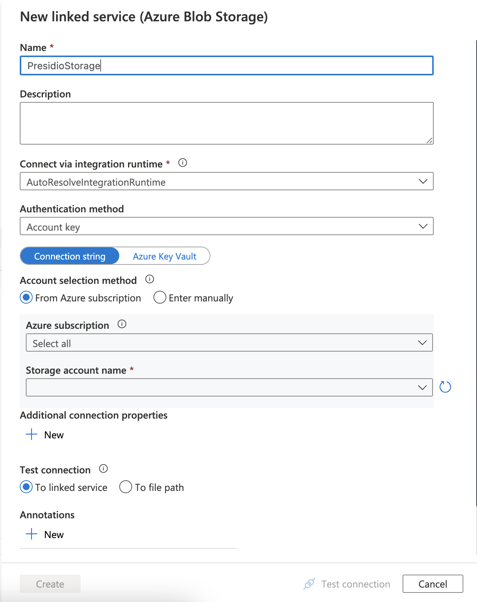
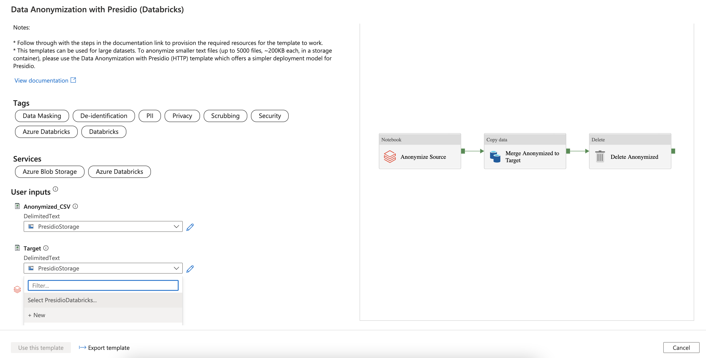
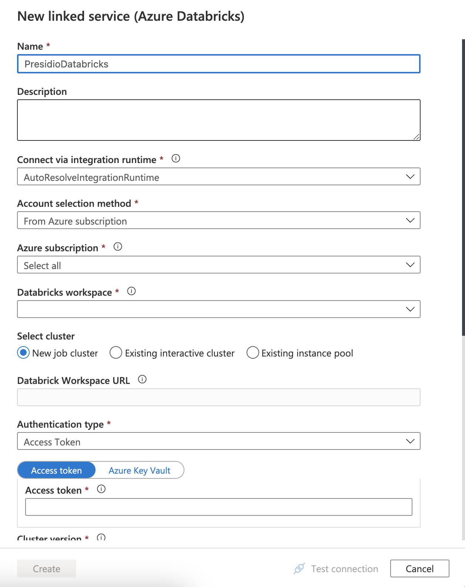
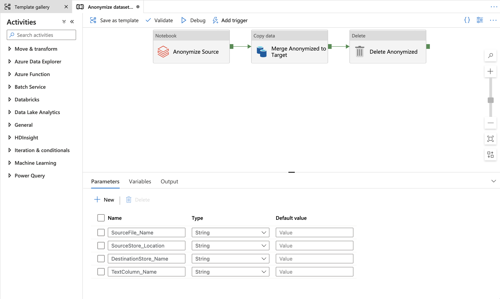
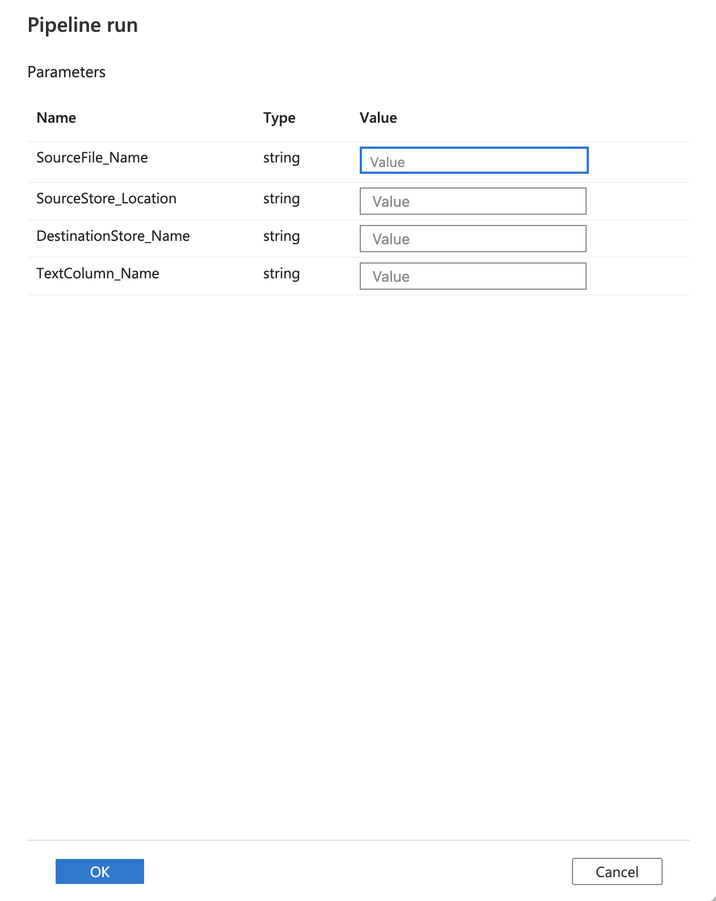
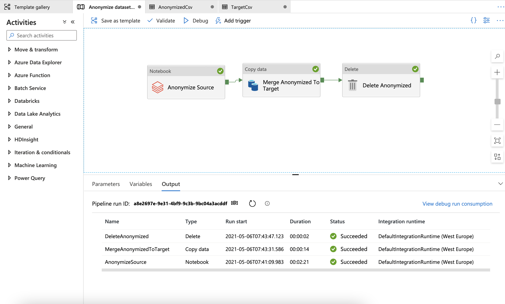

# Anonymize PII entities in datasets using Azure Data Factory template and Presidio on Databricks

This sample uses the built in [data anonymization template](https://github.com/Azure/Azure-DataFactory/tree/main/templates/Data%20Anonymization%20with%20Presidio%20on%20Databricks) of Azure Data Factory which is a part of the Template Gallery to copy a csv dataset from one location to another while anonymizing a text column in the dataset from PII data. It leverages the code for using [Presidio on Azure Databricks](../spark/index.md) to call Presidio as a Databricks notebook job in the Azure Data Factory (ADF) pipeline to transform the input dataset before mergine the results to an Azure Blob Storage.

**Note that** this solution is capabale of transforming large datasets. For smaller, text based input you may want to work with the [Data Anonymization with Presidio as an HTTP service](./presidio-data-factory-template-gallery-http.md) template which offers an easier deployment for Presidio.

The sample deploys the following Azure Services:

* Azure Storage - The target storage account where data will be persisted.
* Azure Databricks - Host presidio to anonymize the data.

Additionaly you should already have an instance of Azure Data Factory which hosts and orchestrates the transformation pipeline and a storage account which holds the source files.

## About this Solution Template

This template gets the files from your source file-based store. It then anonymizes the content and uploads each of them to the destination store.

The template contains three activities:

* **AnonymizeSource** runs the presidio notebook on the input file to create an output folder with csv parts.
* **MergeAnonymizedToTarget** merges the csv parts from databricks output folder to a single csv on the target storage container.
* **DeleteAnonymized** deletes the temporary output folder.

The template defines four parameters:

* **SourceStore_Location** is the container name of your source store where you want to move files from (STORAGE_CONTAINER_NAME).
* **DestinationStore_Name** is the container name in the target storage account which is provisioned by the ARM template.
* **SourceFile_Name** is the name of the input file.
* **TextColumn_Name** is the name of the column to be anonymized.

## How to use this Solution Template

To use this template you should first setup the required infrastructure for the sample to run, then setup the template in Azure Data Factory.

### Setup Presidio

Provision and setup the datbricks cluster by following the Deploy and Setup steps in [presidio-spark sample](../spark/index.md#Pre-requisites).
Take a note of the authentication token and do not follow the "Running the sample" steps.

### Setup Azure Data Factory

1. Go to the Data anonymization with Presidio on Databricks template. Select the AnonymizedCSV connection (Azure Storage) and select "New" from the drop down menu.

2. Name the service "PresidioStorage" and select the storage account that was created in the previous steps from your subscription. Note that Target source was also selecte as the sample uses the same storage account for both source and target.

3. Select the Anonymize Source connection (Databricks) and select "New" from the drop down menu.

4. Name the service "PresidioDatabricks" and select the Azure Databricks workspace that was created in the previous steps from your subscription. Follow through the steps to input the authentication token which was generated in the [previous step](../spark/index.md#Setup-Databricks), or create a new one by following [this guide](https://docs.microsoft.com/en-us/azure/databricks/dev-tools/api/latest/authentication). Select presidio_cluster to run the job.

5. Select Use this template tab

6. You'll see the pipeline, as in the following example:

7. Upload a csv file to the storage container and select Debug, enter the Parameters, and then select Finish. The parameters are the container where you want to move files from, the container name where you want to move the anonymized files to, the csv file name and the name of a text column in the csv file.

8. Review the result.

